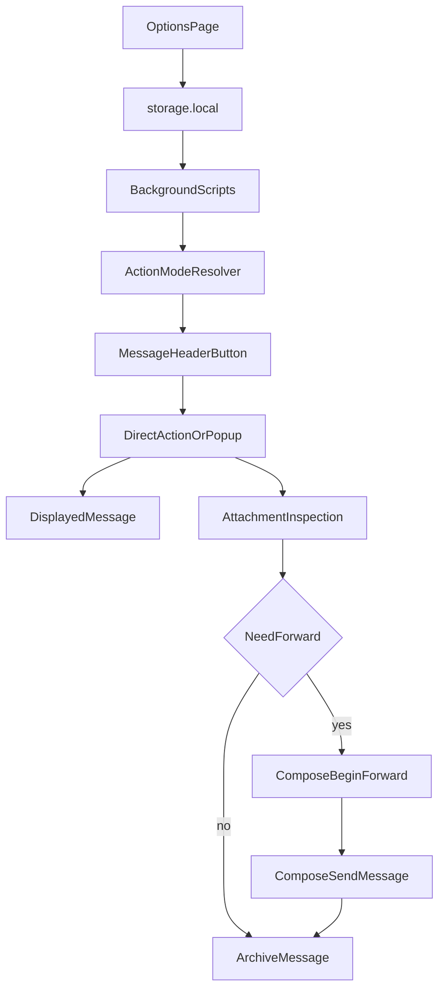

# Architecture

## Overview

The extension is intentionally split into small, testable modules:

- `manifest.json` defines the Thunderbird MV3 add-on, permissions, icons,
  options page, and the single menu-typed message header action.
- `src/background.js` wires Thunderbird events to the extension logic.
- `src/lib/config.js` validates and persists action definitions in
  `storage.local`.
- `src/lib/menu.js` decides whether the header action should execute directly or
  open the chooser popup.
- `src/lib/forwarding.js` resolves the displayed message, checks attachments,
  forwards when needed, and archives when appropriate.
- `src/options/` contains the preferences UI for managing configured actions.
- `src/popup/` contains the chooser popup shown when multiple actions exist.

## Data Model

Each configured action is stored as:

```json
{
  "id": "finance",
  "label": "Finance",
  "destinationEmail": "finance@example.com",
  "requirePdfAttachment": true
}
```

## Runtime Flow



## Error Handling

- Invalid saved configuration entries are ignored during load rather than
  breaking the entire extension.
- Save attempts from the options page reject invalid labels or destination
  addresses.
- Forwarding failures surface a Thunderbird notification and prevent archiving.
- Menu refresh failures are logged to the Thunderbird console.
